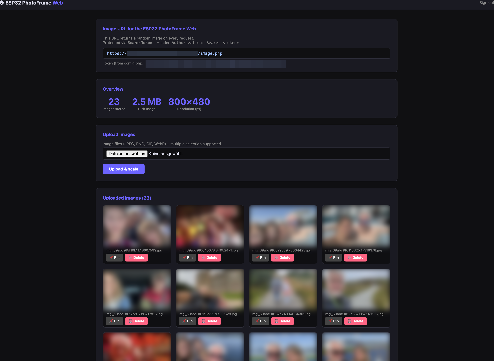
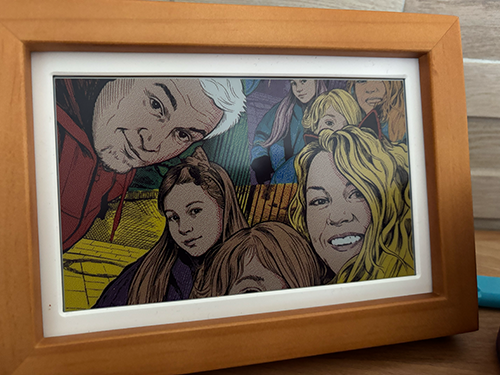

# ESP32 PhotoFrame Web

PHP-based web interface for ESP32 digital photo frames.  
Upload, manage and display images via a random-image URL on your frame.



<p align="center"></p>


---

## About this project

I own a **[Waveshare ESP32-S3 PhotoPainter](https://www.waveshare.com/esp32-s3-photopainter.htm)** – a beautiful 7.3-inch e-ink display.

By default the device runs Waveshare's stock firmware, but there is a much better open-source alternative:  
👉 **[aitjcize/esp32-photoframe](https://github.com/aitjcize/esp32-photoframe)**

Once you flash this firmware, the frame can be configured with:
- an **HTTPS image URL** to fetch photos from
- a **Bearer Token** for authenticated access

This project is the server-side companion: a self-hosted PHP web app where I upload and manage photos that are then served **randomly** to my e-ink frame on every refresh cycle.

---

## Features

- **Admin interface** – upload, preview & delete images (password protected)  
- **Random image** – `image.php` returns a difficerent image on every request (Bearer Token auth)  
- **Auto-scaling** – every image is resized to **800 × 480 px** (cover mode, centre crop – no black bars)  
- **Pin** – mark one image to be shown on the very next request, then back to random  
- **Multi-upload** – select multiple files at once  
- **Security** – config.php never served publicly, upload directory locked via `.htaccess`

---

## Directory structure

```
picture-frame-os/
├── config.php        ← passwords & settings (NOT publicly accessible)
├── index.php         ← admin interface
├── image.php         ← image URL for the frame
├── .htaccess         ← security headers, block config.php
└── uploads/
    ├── .htaccess     ← no PHP execution in upload folder
    └── .pinned       ← stores the pinned filename (auto-managed)
```

---

## Installation

1. Copy files to a PHP-capable web server (Apache + mod_rewrite recommended)
2. Copy the example config and **set your passwords**:
   ```bash
   cp config.example.php config.php
   ```
   Then edit `config.php`:
   ```php
   define('ADMIN_PASSWORD', 'yourSecurePassword');
   define('FRAME_TOKEN',    'yourBearerToken');   // generate: openssl rand -base64 48
   ```
3. The `uploads/` directory must be **writable** by the web server:
   ```bash
   chmod 755 uploads/
   chown www-data:www-data uploads/
   ```
4. PHP extension **GD** must be enabled (`extension=gd` in php.ini)

---

## Usage

### Admin interface
`https://your-domain.com/`  
→ Log in with credentials from `config.php` → upload / pin / delete images

### Image URL for the ESP32 PhotoFrame Web
```
https://your-domain.com/image.php
```
Set the request header:
```
Authorization: Bearer YOUR_TOKEN
```

---

## Requirements

- PHP ≥ 7.4 with **GD** extension  
- Apache with `mod_rewrite`, `mod_headers`  
- HTTPS recommended (Let's Encrypt)
